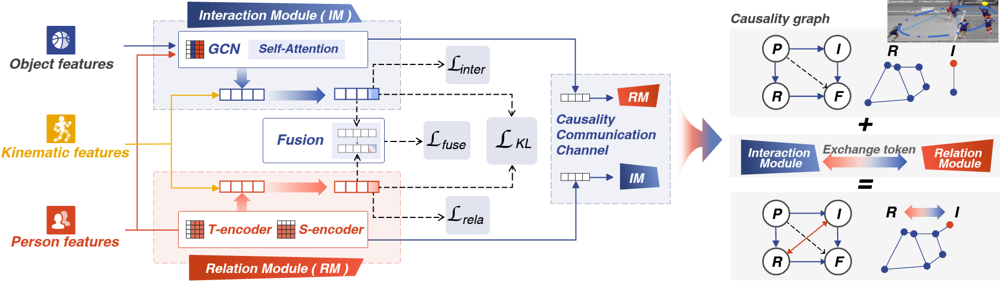

# Bi-Causal
By Youliang Zhang, Wenxuan Liu, Danni Xu, Zhuo Zhou, Zheng Wang.
This repository is an official implementation of the paper 
[Bi-Causal: Group Activity Recognition via Bidirectional Causality CVPR 2024]

## Introduction
Current approaches in Group Activity Recognition (GAR) predominantly emphasize Human Relations (HRs) while often neglecting the impact of Human-Object Interactions (HOIs). This study prioritizes the consideration of both HRs and HOIs, emphasizing their interdependence. Notably, employing Granger Causality Tests reveals the presence of bidirectional causality between HRs and HOIs. Leveraging this insight, we propose a Bidirectional-Causal GAR network.
This network establishes a causality communication channel while modeling relations and interactions, enabling reciprocal enhancement between human-object interactions and human relations, ensuring their mutual consistency. Additionally, an Interaction Module is devised to effectively capture the dynamic nature of human-object interactions.
Comprehensive experiments conducted on two publicly available datasets showcase the superiority of our proposed method over state-of-the-art approaches.


## Usage

### Requirements
conda create -n bicausal python=3.8.18       
conda activate bicausal   
pip install torch==2.0.0+cu118 torchvision==0.15.0+cu118                                                                                              
pip install matplotlib     
pip install scikit-learn     
pip install numba  
pip install pillow
pip install zlib
pip install pyyaml      
pip install opencv-python  
pip install scipy     
pip install tqdm   


### Volleyball Dataset
Please refer to [this repo](https://github.com/mostafa-saad/deep-activity-rec#dataset) to obtain the raw files (such as video frames and annotations) of the Volleyball dataset. 
For convenience, we have also zipped and uploaded the Volleyball data folder that we used when we ran COMPOSER, and you can download the data using [this link](https://drive.google.com/file/d/1NF7aiplia3g5Ng5pARoYjS47wPz66XCx/view?usp=sharing). The file size is large though (62.23 GB).
The folder contains the following files and subdirectories:

The raw data for the volleyball dataset can be obtained from [this repo](https://github.com/mostafa-saad/deep-activity-rec#dataset). 
We obtained keypoint data from [COMPOSER](https://github.com/hongluzhou/composer) and followed their work for dataset formatting. 
It is worth noting that although our code does not require image data, the annotations.txt file in the videos/ folder is crucial.

- volleyball/
    - videos/
    - joints/
    - tracks_normalized.pkl
    - tracks_normalized_with_person_action_label.pkl
    - volleyball_ball_annotation/

### Training
```bash
python main.py train --mode train --cfg configs/volleyball_config.yml
```
###  Testing 
```bash
python main.py test --mode test --cfg configs/volleyball_config.yml --checkpoint your_best_model.pth 
```

## Citing Bi-Causal
If you find this work is useful in your research, please consider citing:
```bibtex
//todo
```


## More Info
A humble version has been released.

Any suggestion are welcome. We are glad to optimize our code and provide more details.

